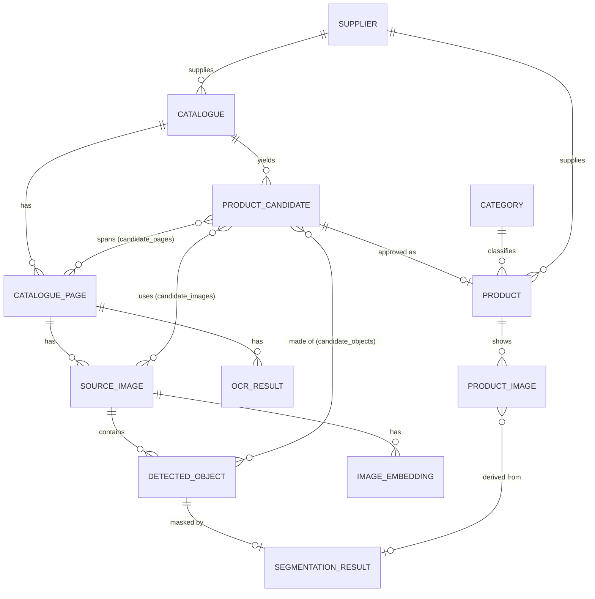

# Database design

## Traceability

Every published product can be traced back to the exact pixels it came from:

A **candidate** is a proposal. The three association tables let *one* candidate span many pages,
images and detected objects (multi-angle products, workstation "systems"). Nothing is customer-visible
until an admin approves a candidate into a **product**.

## Provenance (raw vs AI vs human-verified)

* `product_candidates.fields` (JSONB) holds every extracted field with its source and confidence, e.g.
  `{"name": {"value": "YY-11", "source": "OCR", "confidence": 0.97}, "dimensions": null}`.
  Unknown values are stored as `null` — never guessed.
* `products` has typed columns for the verified, customer-facing values plus `field_provenance` (JSONB)
  recording where each came from, and `origin` = `AI` | `AI_HUMAN_REVIEW` | `HUMAN`.
* `correction_records` stores AI value vs human value for every admin edit; it is the future
  fine-tuning / evaluation dataset and deliberately outlives the candidate it refers to.
* `price` is nullable and requires a `currency` (check constraint): a price exists only if the source
  or an admin supplied one.

## Deletion rules

| Deleting… | Effect |
| --- | --- |
| a catalogue | cascades to pages, images, OCR, detections, masks, embeddings, candidates, jobs |
| a catalogue | **published products survive**; their `candidate_id`, `catalogue_id`, `source_page_id` and image trace links become `NULL` |
| a product | cascades to its images, wishlist entries; enquiries and corrections keep a `NULL` reference |
| a category with children, or with products | **blocked** (`RESTRICT`) |
| a supplier with catalogues or products | **blocked** (`RESTRICT`) |
| a user | audit-log rows stay (`actor_email` is denormalised); other references become `NULL` |

## Authentication tables

* `users` also carries `failed_login_attempts` and `locked_until` (brute-force lockout).
* `refresh_tokens`: one row per issued refresh token. Only a SHA-256 digest (`token_hash`, unique) is stored.
  Tokens from one login share a `family_id` (= one browser session); rotating sets `revoked_at` on the used token and
  inserts its successor in the same family. A session is live while its family has an unrevoked, unexpired token.
  Rows are deleted with their user.

## Ingestion tables

Uploaded catalogues, pages, images and jobs use the tables above; files themselves live in storage
(see `docs/ingestion.md`), referenced by `storage_key` / `image_key` (never by user-supplied names).
`catalogue_pages.status` is `PENDING → PROCESSING → RENDERED → TEXT_READ → PANELS_FOUND` (or `FAILED`); later pipeline stages move it on.
Phase 4 fills `ocr_results` (one row per text line: text, confidence, language, polygon, box, engine name and
version) and sets `catalogue_pages.page_type` / `page_type_confidence`. Phase 5a adds one `source_images` row of
kind `REGION` per photo panel (its box on the page in `bbox_*`, the cut-out file in `storage_key`;
`region_confidence` stays empty because panel detection is geometric, not scored).
Migration `0003` adds `source_images.origin` (`AI` / `AI_HUMAN_REVIEW` / `HUMAN`: who made the box) and the
`panel_edits` table (one row per manual change to a page's panels, with before/after snapshots and an
`undone_at` marker; see `docs/panel-editor.md`).

## Conventions

* UUID primary keys generated by the database (`gen_random_uuid()`).
* Timestamps are `timestamptz`.
* Constraint and index names follow a fixed naming convention, so migrations are deterministic.
* Enums are `VARCHAR` + application-level validation.
* Bounding boxes are stored as `bbox_x0/y0/x1/y1` in the pixel coordinates of the page/image they belong to.
